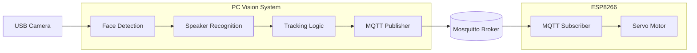

# System Overview

High-level view of the BENAX architecture showing the AI pipeline on the PC and the servo control on the ESP8266.

```mermaid
flowchart LR

    CAM[USB Camera]

    subgraph PC["PC Vision System"]
        DETECT[Face Detection]
        RECOG[Speaker Recognition]
        TRACK[Tracking Logic]
        MQTTPUB[MQTT Publisher]
    end

    BROKER[(Mosquitto Broker)]

    subgraph ESP["ESP8266"]
        SUB[MQTT Subscriber]
        SERVO[Servo Motor]
    end

    CAM --> DETECT
    DETECT --> RECOG
    RECOG --> TRACK
    TRACK --> MQTTPUB
    MQTTPUB --> BROKER
    BROKER --> SUB
    SUB --> SERVO
```