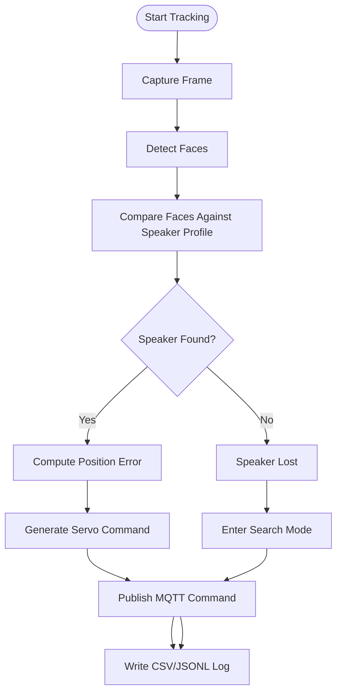

# Runtime Processing Pipeline

End-to-end processing performed while the system is tracking the enrolled speaker.

```mermaid
flowchart TD

    START([Start Tracking])

    CAPTURE[Capture Frame]
    DETECT[Detect Faces]
    MATCH[Compare Faces Against Speaker Profile]

    DECISION{Speaker Found?}

    TRACK[Compute Position Error]
    COMMAND[Generate Servo Command]

    LOST[Speaker Lost]
    SEARCH[Enter Search Mode]

    MQTT[Publish MQTT Command]
    LOG[Write CSV/JSONL Log]

    START --> CAPTURE
    CAPTURE --> DETECT
    DETECT --> MATCH

    MATCH --> DECISION

    DECISION -->|Yes| TRACK
    TRACK --> COMMAND
    COMMAND --> MQTT
    MQTT --> LOG

    DECISION -->|No| LOST
    LOST --> SEARCH
    SEARCH --> MQTT
    MQTT --> LOG
```