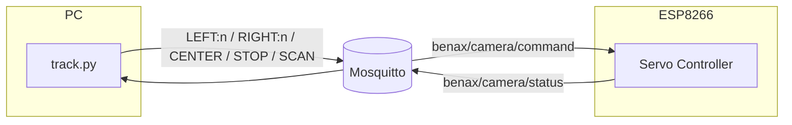

# MQTT Communication Flow

Topics exchanged between the PC and ESP8266.

```mermaid
flowchart LR

    subgraph PC
        TRACK[track.py]
    end

    BROKER[(Mosquitto)]

    subgraph ESP8266
        SERVO[Servo Controller]
    end

    TRACK -- LEFT:n / RIGHT:n / CENTER / STOP / SCAN --> BROKER

    BROKER -->|benax/camera/command| SERVO

    SERVO -->|benax/camera/status| BROKER

    BROKER --> TRACK
```