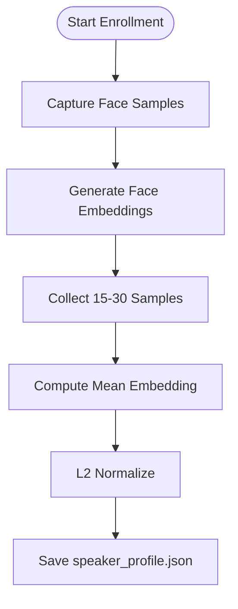

# Speaker Enrollment Process

Creation of the authorized speaker profile used for recognition.

```mermaid
flowchart TD

    START([Start Enrollment])

    CAMERA[Capture Face Samples]

    EMBED[Generate Face Embeddings]

    COLLECT[Collect 15-30 Samples]

    MEAN[Compute Mean Embedding]

    NORMALIZE[L2 Normalize]

    SAVE[Save speaker_profile.json]

    START --> CAMERA
    CAMERA --> EMBED
    EMBED --> COLLECT
    COLLECT --> MEAN
    MEAN --> NORMALIZE
    NORMALIZE --> SAVE
```