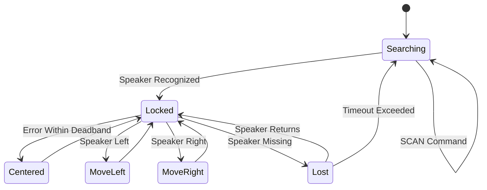

# Tracking State Machine

Core behavior used while following the enrolled speaker.

```mermaid
stateDiagram-v2

    [*] --> Searching

    Searching --> Locked : Speaker Recognized

    Locked --> Centered : Error Within Deadband
    Locked --> MoveLeft : Speaker Left
    Locked --> MoveRight : Speaker Right

    MoveLeft --> Locked
    MoveRight --> Locked
    Centered --> Locked

    Locked --> Lost : Speaker Missing

    Lost --> Locked : Speaker Returns
    Lost --> Searching : Timeout Exceeded

    Searching --> Searching : SCAN Command
```